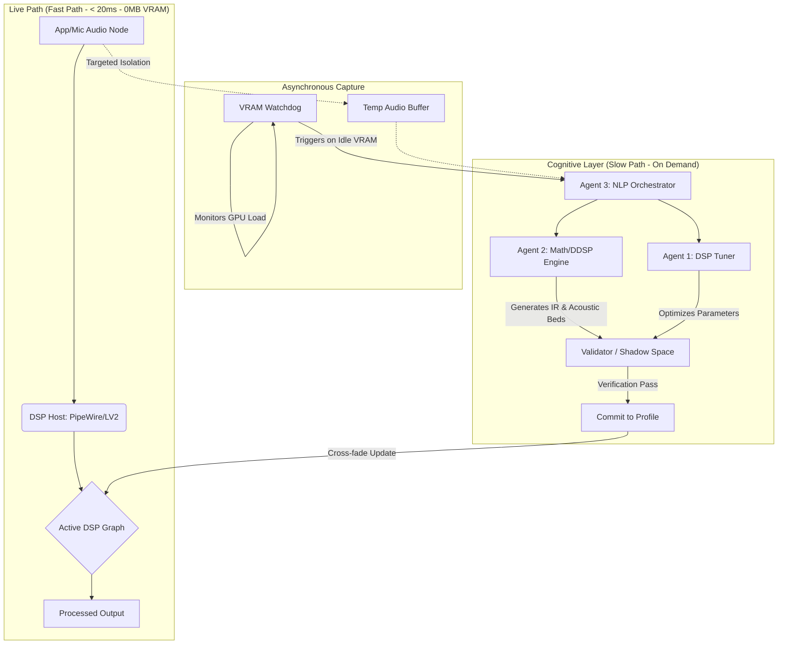

# Faurge ⚒️

**Faurge** (Forge + Audio) is an agentic AI engine designed to "hammer" raw audio into professional-grade, idealized sound. Operating in real-time between your hardware and your applications, Faurge functions as an AI-powered mixing engineer, room corrector, and acoustic architect.

## 🏗 Architecture & Hardware Awareness
Faurge utilizes a **Split-Brain** topology that fundamentally separates active digital signal processing from heavy AI inference. It is built with a strict "Zero-Idle Overhead" philosophy, making it a viable tool for gamers and power users operating under strict VRAM constraints.

### The Workflow
The system separates the **Fast Path** (Real-time DSP) from the **Slow Path** (AI Reasoning), utilizing a Watchdog to ensure AI inference only occurs when the system has available compute.



## 🤖 The Agents
* **Agent 1 (The Tuner):** A Reinforcement Learning agent that manipulates standard DSP tools (EQ, Compression) to match "Golden Reference" targets.
* **Agent 2 (The Math Engine):** A Differentiable DSP (DDSP) model that handles complex wave manipulation, blind deconvolution, harmonic synthesis, and Comfort Noise Generation (CNG).
* **Agent 3 (The Orchestrator):** The NLP brain that translates semantic prompts into actionable tasks for the other agents.

## 🛠 Key Features
- **Acoustic Seeding:** Synthesizes high-fidelity "Room Tone" beneath heavily gated or dead microphone signals to eliminate listener fatigue and create a natural acoustic environment.
- **Asynchronous Gaming Optimization:** Isolates and records specific application audio during heavy loads, waiting for VRAM to free up before analyzing and generating an optimized tactical DSP profile.
- **The Shadow Realm:** A non-audible parallel environment where agents test and validate acoustic changes before applying them to your ears.
- **De-Rooming:** High-precision inverse-filtering to neutralize suboptimal room acoustics.
- **Hardware Agnostic:** Improves the performance of entry-level hardware through software-defined filters.

## 🚀 Getting Started
Faurge is built for **Linux (Pop!_OS/Ubuntu)** using PipeWire.

### Prerequisites
- PipeWire & WirePlumber
- Python 3.10+
- LSP Plugins (Linux Studio Plugins)
- NVIDIA GPU (For VRAM Watchdog features)

### Installation
```bash
git clone [https://github.com/itorousa/faurge.git](https://github.com/itorousa/faurge.git)
cd faurge
pip install -r requirements.txt
```

## 📜 Development Status
Faurge is currently in **Phase 1: The Shell**. We are establishing the core PipeWire routing, the VRAM watchdog daemon, and manual DSP controls.

---
*Faurge development is concurrent with owrk on [Sentinel](https://github.com/kosher-t/sentinel).*
