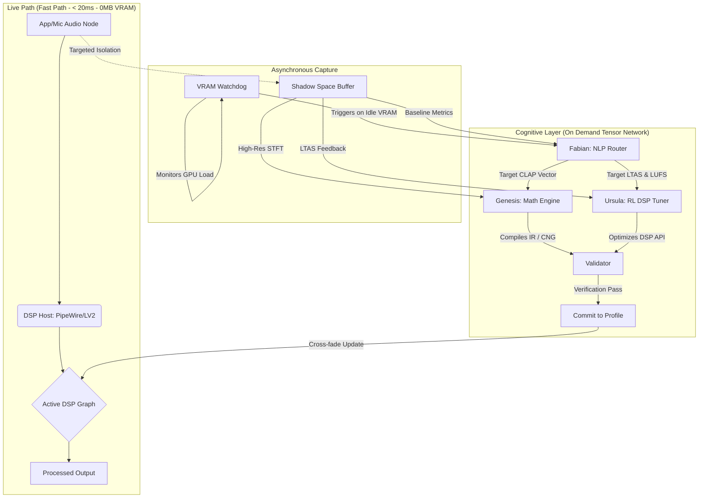

# Faurge ⚒️

**Faurge** (Forge + Audio) is an agentic AI engine designed to "hammer" raw audio into professional-grade, idealized sound. Operating in real-time between your hardware and your applications, Faurge functions as an AI-powered mixing engineer, room corrector, and acoustic architect.

## 🏗 Architecture & Hardware Awareness
Faurge utilizes a **Split-Brain** topology that fundamentally separates active digital signal processing from heavy AI inference. It is built with a strict "Zero-Idle Overhead" philosophy, making it a viable tool for gamers and power users operating under strict 4GB VRAM constraints.

### The Workflow: Bake and Sleep
Faurge AI agents **do not run constantly in the background**. The system separates the **Fast Path** (Real-time C++ DSP) from the **Slow Path** (AI Reasoning). 

When triggered, Faurge captures a 5-second buffer of your audio into the Shadow Space. The AI agents wake up, calculate the optimal EQ parameters and generate static Impulse Responses (IRs). They "bake" these solutions into the active PipeWire DSP plugins, and immediately unload from VRAM. The lightweight C++ plugins handle the live audio stream with `<1%` CPU usage.




## 🤖 The Agents (Fa-Ur-Ge)
Faurge abandons pure semantic communication between agents in favor of concrete physics and high-dimensional latent space embeddings.

* **Fabian (Agent 1):** The Semantic Router. A lightweight CLAP-based model that translates user intent into a **Split Destination**: concrete physics (LTAS/LUFS targets) for the source, and abstract math (CLAP vectors) for the scene.
* **Ursula (Agent 2):** The DSP Tuner. A Reinforcement Learning (RL) agent that manipulates standard headless DSP plugins (EQ, Compression, De-essing) to mathematically match Fabian's physical LTAS/LUFS targets.
* **Genesis (Agent 3):** The Generative Math Engine. A Differentiable DSP (DDSP) model utilizing STFT math. She bridges the gap between Fabian's semantic CLAP vector and physical reality, synthesizing exact Impulse Responses and Procedural Comfort Noise without drawing raw audio waveforms.

## 🛠 Key Features
- **Acoustic Seeding:** Synthesizes high-fidelity procedural "Room Tone" beneath heavily gated or dead microphone signals to eliminate listener fatigue.
- **Asynchronous Optimization:** Isolates and records specific application audio, waking the AI agents only when VRAM is free to generate an optimized tactical profile.
- **The Shadow Realm:** A non-audible parallel environment where agents extract features and validate acoustic changes before applying them to your live audio stream.
- **De-Rooming:** High-precision inverse-filtering to neutralize suboptimal room acoustics.

## 🚀 Getting Started
Faurge is built for **Linux (Pop!_OS/Ubuntu)** using PipeWire.

### Prerequisites
- PipeWire & WirePlumber
- Python 3.10+
- Standard headless LV2/LADSPA Plugins
- NVIDIA GPU (For VRAM Watchdog features)

### Installation
```bash
git clone [https://github.com/itorousa/faurge.git](https://github.com/itorousa/faurge.git)
cd faurge
pip install -r requirements.txt
```

## 📜 Development Status
Faurge is currently in **Phase 1: The Shell**. We are establishing the core PipeWire routing, the VRAM watchdog daemon, and manual DSP controls.