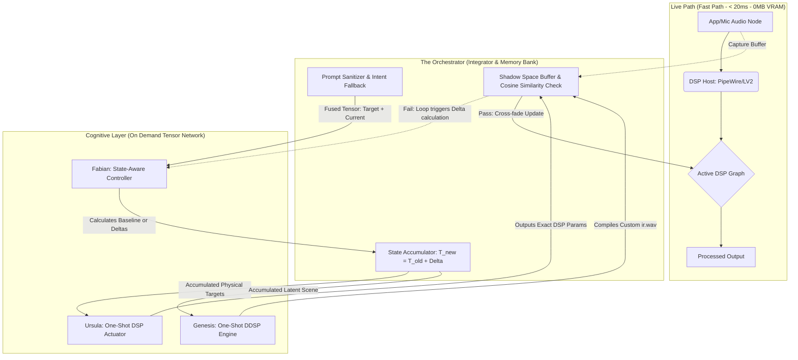

# Faurge ⚒️

> **Development is currently for Linux OS only. Windows and MacOS versions coming soon.**

**Faurge** (Forge + Audio) is an agentic AI engine designed to "hammer" raw audio into professional-grade, idealized sound. Operating in real-time between your hardware and your applications, Faurge functions as an AI-powered mixing engineer, room corrector, and acoustic architect.

## 🏗 Architecture & Hardware Awareness
Faurge utilizes a **Split-Brain** topology that fundamentally separates active digital signal processing from heavy AI inference. It is built with a strict "Zero-Idle Overhead" philosophy, making it a viable tool for gamers and power users operating under strict 4GB VRAM constraints.

### The Workflow: The State-Aware Closed Loop
Faurge AI agents **do not run constantly in the background**. The system separates the **Fast Path** (Real-time C++ DSP) from the **Slow Path** (AI Reasoning). 

Instead of an open-loop guess, Faurge operates as a closed-loop state-space model governed by the Python Orchestrator. When triggered, the Orchestrator captures a 5-second buffer into the Shadow Space. The AI evaluates the mathematical gap between your current microphone and your desired acoustic scene. 

The models "bake" the required C++ plugin parameters and custom Impulse Responses (IRs) in one-shot forward passes, validate the resulting audio via a reflection loop, and immediately unload from VRAM. The lightweight C++ plugins then handle the live audio stream with `<1%` CPU usage.



## 🤖 The Agents (Fa-Ur-Ge)
Faurge abandons pure semantic communication between agents in favor of concrete physics and high-dimensional latent space embeddings. The agents are strictly stateless; all memory is handled mathematically by the Orchestrator.

* **The Orchestrator:** The Python-based backbone running on the CPU. It sanitizes user intent, fuses the latent states, and acts as the mathematical accumulator/integrator to prevent the AI loop from oscillating.
* **Fabian (Agent 1):** The State-Aware Controller. A custom CLAP-based routing model that evaluates the fused 1024D tensor (Target + Current Audio). He calculates the exact error (Cosine Similarity) and outputs **Deltas** (refinements) to bridge the gap.
* **Ursula (Agent 2):** The DSP Actuator. A completely deterministic, **One-Shot** feed-forward network during live execution. She receives absolute physical targets (LTAS/LUFS) from the Orchestrator and outputs the exact parameters required for standard headless C++ plugins.
* **Genesis (Agent 3):** The Generative Math Engine. A Differentiable DSP (DDSP) model utilizing STFT math. Operating as a **One-Shot** actuator, she reads the raw audio spectrogram and mathematically synthesizes exact Impulse Responses (`ir.wav`) to delete bad room acoustics and reconstruct missing vocal harmonics.

## 🛠 Key Features
- **Closed-Loop Reflection:** Automatically audits its own DSP output in the Shadow Space, refining parameters until the audio mathematically matches the user's prompt before pushing to the live stream.
- **Intent Fallback:** Intelligently intercepts vague user prompts (e.g., "make it better") and translates them into mathematically dense acoustic targets to prevent latent-space collapse.
- **Asynchronous Optimization:** Isolates and records specific application audio, waking the AI agents only when VRAM is free to generate an optimized tactical profile.
- **Acoustic Seeding:** Synthesizes high-fidelity procedural "Room Tone" beneath heavily gated or dead microphone signals to eliminate listener fatigue.

## 🚀 Getting Started
Faurge is built for **Linux (Pop!_OS/Ubuntu)** using PipeWire.

### Prerequisites
- PipeWire & WirePlumber
- Python 3.10+
- Standard headless LV2/LADSPA Plugins

### Installation
```bash
git clone [https://github.com/itorousa/faurge.git](https://github.com/itorousa/faurge.git)
cd faurge
pip install -r requirements.txt
```

## 📜 Development Status
Faurge is currently in **Phase 1: The Shell**. We are establishing the core PipeWire routing, the VRAM watchdog daemon, and manual DSP controls.