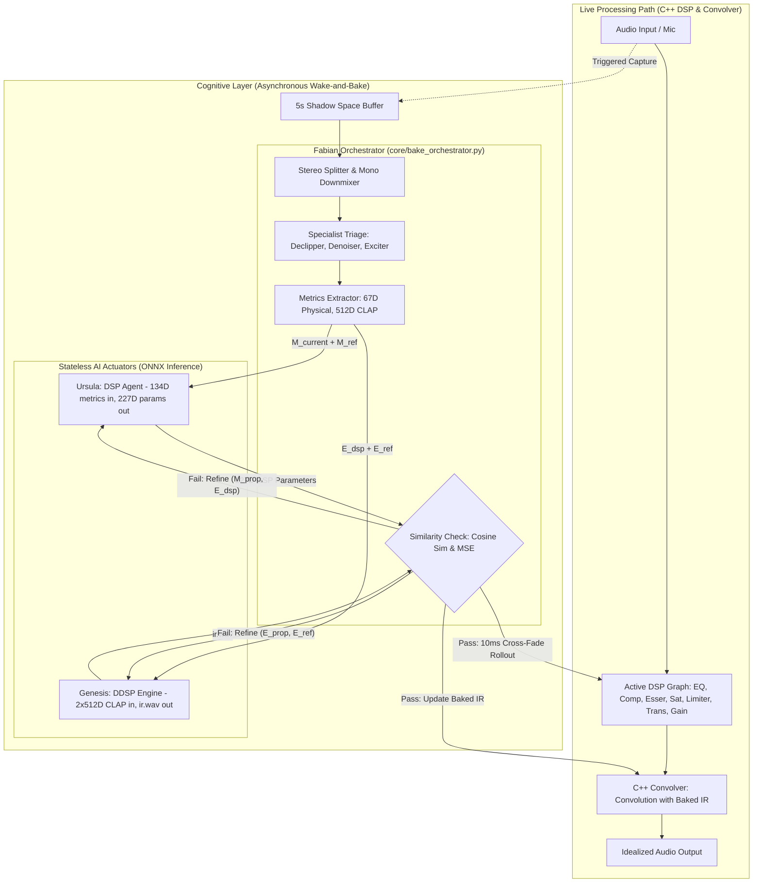

# Faurge ⚒️
> **The Generative Acoustic Reality Engine**

[](#)
[](#)
[](#)

**Faurge** (Forge + Audio) is an agentic AI engine designed to "hammer" raw audio into professional-grade, idealized sound. Operating in real-time between your physical audio hardware and your applications, Faurge acts as a software-defined vocal tract and acoustic environment. It is engineered to automatically correct hardware deficiencies, neutralize bad room acoustics, and reconstruct professional-grade audio textures.

---

## 🏗️ Architecture & Philosophy: The Split-Brain

Faurge is built with a strict **Zero-Idle Overhead** philosophy. It utilizes a **Split-Brain** topology that fundamentally separates active, low-latency digital signal processing from heavy AI neural inference. This allows Faurge to run comfortably on power-user or gaming systems with strict 4GB VRAM limits.


```mermaid
graph TD
    %% Define Styles
    classDef fastPath fill:#112233,stroke:#00aaee,stroke-width:2px,color:#ffffff;
    classDef slowPath fill:#221133,stroke:#bb00ff,stroke-width:2px,color:#ffffff;
    classDef orchestrator fill:#223311,stroke:#00aa22,stroke-width:2px,color:#ffffff;

    subgraph FastPath ["Live Processing Path (C++ DSP & Convolver)"]
        InMic[Audio Input / Mic] --> ActiveDSP[Active DSP Graph: EQ, Comp, Esser, Sat, Limiter, Trans, Gain]
        ActiveDSP --> Convolver[C++ Convolver: Convolution with Baked IR]
        Convolver --> FinalOut[Idealized Audio Output]
    end
    class InMic,ActiveDSP,Convolver,FinalOut FastPath;

    subgraph SlowPath ["Cognitive Layer (Asynchronous Wake-and-Bake)"]
        AsynBuffer[5s Shadow Space Buffer]
        
        subgraph FabianOrch ["Fabian Orchestrator (core/bake_orchestrator.py)"]
            Splitter[Stereo Splitter & Mono Downmixer]
            Triage[Specialist Triage: Declipper, Denoiser, Exciter]
            MetricExt[Metrics Extractor: 67D Physical, 512D CLAP]
            SimCheck{Similarity Check: Cosine Sim & MSE}
        end
        
        subgraph Agents ["Stateless AI Actuators (ONNX Inference)"]
            Ursula[Ursula: DSP Agent - 134D metrics in, 227D params out]
            Genesis[Genesis: DDSP Engine - 2x512D CLAP in, ir.wav out]
        end
    end
    class AsynBuffer,Splitter,Triage,MetricExt,SimCheck,Ursula,Genesis SlowPath;

    %% Data Flow
    InMic -.-> |Triggered Capture| AsynBuffer
    AsynBuffer --> Splitter
    Splitter --> Triage
    Triage --> MetricExt
    MetricExt --> |M_current + M_ref| Ursula
    MetricExt --> |E_dsp + E_ref| Genesis
    
    Ursula --> |227D DSP Parameters| SimCheck
    Genesis --> |ir.wav| SimCheck
    
    SimCheck --> |"Fail: Refine (M_prop, E_dsp)"| Ursula
    SimCheck --> |"Fail: Refine (E_prop, E_ref)"| Genesis
    
    SimCheck --> |"Pass: 10ms Cross-Fade Rollout"| ActiveDSP
    SimCheck --> |"Pass: Update Baked IR"| Convolver
```

### The "Bake and Sleep" Model
1. **The Fast Path (C++ DSP)**: Standard, lightweight C++ plugins (EQ, Compressor, Limiter, etc.) and a convolver process live audio in real-time, operating on the CPU with **<1% CPU usage** and **<20ms latency**. No AI runs during this phase, requiring **0 MB of VRAM**.
2. **The Shadow Space (Asynchronous Capture)**: When triggered, the system captures a 5-second buffer of raw input audio into the *Shadow Space* (an offline parallel environment).
3. **The Bake (Slow Path AI)**: The AI models load into VRAM, perform one-shot forward passes to compute optimal parameters and synthesize a custom Impulse Response (`ir.wav`), and immediately unload from memory.
4. **The Update**: The system updates the C++ plugin parameters and the convolution filter in the live stream via a seamless 10ms cross-fade, and the AI goes back to sleep.

> [!NOTE]
> Faurge supports a **CPU-Only Mode** via OpenVINO. If no NVIDIA or AMD GPU is detected at startup, the VRAM watchdog daemon is disabled and all tensor math runs locally on the CPU.

---

## 🤖 The Fa-Ur-Ge Triad

Instead of semantic text prompting, Faurge is an **audio-to-audio matching engine**. The system compares the physical and latent features of the user's input audio ($A_{in}$) against a high-quality reference recording ($A_{ref}$) using three components:

### 1. Fabian (The Orchestrator)
Located in `core/bake_orchestrator.py`, Fabian is a high-performance Python script rather than a neural model. He manages the execution pipeline, split-brain routing, VRAM load/unload cycles, and the reflection loop. Fabian acts as a stateless state manager, evaluating physical thresholds to trigger specialist C++ plugins and orchestrating AI inference.

### 2. Ursula (The DSP Plugin Agent)
Located in `agents/ursula.py`, Ursula is a policy network trained via Reinforcement Learning (Soft Actor-Critic) in a custom Gymnasium sandbox (`UrsulaDSPEnv-v0`). She receives physical audio metric deltas and outputs precise parameters for the C++ DSP chain. Ursula is blind to semantic text and CLAP embeddings; she operates strictly as a one-shot actuator matching frequency and dynamic envelopes.

### 3. Genesis (The Generative DDSP Engine)
Located in `agents/genesis.py`, Genesis is a Differentiable DSP (DDSP) synthesizer. She maps latent CLAP embeddings to acoustic and harmonic structures. Genesis outputs parameters to construct a 2-second time-domain Impulse Response (`ir.wav`), allowing the system to perform non-linear tasks like room simulation, microphone profiling, and harmonic reconstruction.

---

## 🎛️ The DSP Plugin Suite (Ursula's Actuators)

Ursula controls a cascading chain of seven high-performance C++17 DSP plugins. This chain represents a **227-dimensional action space** ($A \in \mathbb{R}^{227}$) that Ursula modifies in a single forward pass:

1. **Parametric EQ (31-Band)** (`dsp/eq/`): Cascade of 31 biquad filters shaping the frequency spectrum (Log-scaled frequencies from 20 Hz to 20 kHz, gain, Q, and filter type). *186 parameters.*
2. **Dynamic Range Compressor** (`dsp/compressor/`): RC-smoothed sidechain-filtered compressor containing lookahead and soft-knee smoothing. *14 parameters.*
3. **Esser (Dynamic Sibilance Processor)** (`dsp/esser/`): Dynamic bandpass gate targeting high-frequency friction spikes. *6 parameters.*
4. **Harmonic Saturator** (`dsp/saturator/`): Two-times oversampled wave-shaper (Tube, Tape, Diode, and Asymmetric models) with pre/post filtering. *7 parameters.*
5. **Peak Limiter** (`dsp/limiter/`): Lookahead peak predictor with a brickwall ceiling. *6 parameters.*
6. **Transient Shaper** (`dsp/transient/`): Split-envelope transient manipulator to cut room decay or boost speech articulation. *6 parameters.*
7. **Gain & Balance** (`dsp/gain/`): Final level scaling and stereo balancing. *2 parameters.*

---

## 🔀 Stereo Processing: The Hybrid Execution Model

To prevent stereo image drift, transient blurring, or comb filtering while still correcting channel-specific room reflections and off-axis microphone responses, Faurge runs a **Hybrid Execution Model**:

| Plugin / Subsystem | Routing Strategy | Rationale |
| :--- | :--- | :--- |
| **De-clipper, De-noiser, Spectral Exciter** | **Independent (Asymmetric)** | Clipping, background noise (sirens, fan hum), and high-frequency roll-off are highly localized, channel-specific physical errors. |
| **Parametric EQ** | **Independent (Asymmetric)** | Corrects asymmetric room reflections and off-axis microphone capsules by applying independent curves to the Left and Right channels. |
| **Gain & Balance** | **Independent (Asymmetric)** | Centering the vocal image and matching target LUFS requires independent channel gain scaling. |
| **Compressor & Limiter** | **Symmetric (Stereo-Linked)** | Inferred from a mono downmix and applied symmetrically to prevent vocal center drift and transient image skewing. |
| **Esser** | **Symmetric (Stereo-Linked)** | Prevents high-frequency sibilant wandering across the stereo field. |
| **Harmonic Saturator & Transient Shaper** | **Symmetric (Stereo-Linked)** | Ensures identical distortion characteristics and transient articulation across both channels. |
| **Genesis (IR Convolution)** | **Symmetric (Stereo-Linked)** | Synthesizes a single mono $IR_{mono}$ convolved with both channels to guarantee phase safety and prevent comb filtering. |

---

## 📊 Physical Metric Vector (67D Space)

Ursula acts on a **134-dimensional input** consisting of the concatenated metric vectors of the current audio and reference audio:
$$\text{Input} = M_{current} \mathbin{\Vert} M_{ref} \quad (M \in \mathbb{R}^{67})$$

Each 67-dimensional vector $M$ represents a physical snapshot of the audio clip:
* **LTAS (Long-Term Average Spectrum) — 64 Dimensions**: Log-power spectrum mapped to the Bark Scale (spaced between 20 Hz and 20 kHz) to identify spectral peaks, dips, and slopes.
* **LUFS (Integrated Loudness) — 1 Dimension**: Perceived human loudness conforming to the ITU-R BS.1770-4 standard (including head-model K-weighting filters and relative gating thresholds).
* **Dynamic Range — 2 Dimensions**:
  * **Crest Factor**: Log-ratio between peak and RMS amplitude ($20 \log_{10}(x_{peak} / x_{RMS})$). Used to measure transient spikes or clipping.
  * **Zero-Crossing Rate (ZCR)**: The rate of sign transitions in the signal. High ZCR points to high-frequency sibilance or noise; low ZCR indicates vocal harmonics.

### Metric Mapping Matrix

| Metric Delta | Primary Target Plugin | Affected Parameters | Policy Rationale |
| :--- | :--- | :--- | :--- |
| **LTAS Low-End Boost** (Muddy resonances) | **EQ / Compressor** | `EQ Gain (Bands 1-5)`, `Comp sidechain_hp` | Attenuate EQ to remove mud; raise compressor sidechain HP to prevent bass pumping. |
| **LTAS Mid-Range Cut** (Thin/hollow vocals) | **EQ** | `EQ Gain (Bands 12-18)`, `EQ Q` | Apply parametric boosts to restore vocal presence and speech clarity. |
| **LTAS High-End Loss** (Severe high-roll-off) | **Saturator** | `Sat drive`, `Sat mix`, `Sat type` | Apply harmonic saturation to synthesize high-frequency content where none physically exists. |
| **LUFS Deficit** (Quiet signal) | **Gain / Compressor** | `gain_db`, `comp output_trim` | Boost output levels linearly to calibrate absolute loudness matching. |
| **Excessive Crest Factor** (Spiky peaks/plosives) | **Compressor / Limiter** | `comp threshold`, `comp ratio`, `lim ceiling` | Increase compression depth and lower limiter ceiling to trim extreme dynamic peaks. |
| **Lifeless Transients** (Flat/lifeless audio) | **Transient Shaper** | `trans attack_gain`, `trans mix` | Boost transient attack to restore speech articulation and punch. |
| **High ZCR + High LTAS (5-8 kHz)** | **Esser** | `esser threshold`, `esser center_freq` | Lower de-esser threshold and target the center frequency to suppress harsh sibilants. |

---

## 🛠️ The Frontline Specialists (Blind Triage)

Before the AI agents wake up, Fabian scans the input signal for "impossible" errors. If physical destruction is detected, Fabian runs lightweight C++/Rust plugins on the CPU:

* **The Declipper (Cubic/Spline Interpolation)**: Standard polynomial interpolation. If the waveform peaks flatline at 0 dBFS, the declipper reconstructs the missing curves dynamically to eliminate inharmonic distortion.
* **The Denoiser & Dereverberator (DeepFilterNet 3)**: A highly optimized C++/Rust implementation of DeepFilterNet 3. It runs in the STFT domain to strip background interference (HVAC, keyboard clicks) and suppress late acoustic room reflections.
* **The Spectral Exciter (Harmonic Synthesis)**: Synthesizes high-frequency harmonics and subharmonic octaves in parallel. This provides Ursula with actual physical data to shape rather than boosting empty frequency bands.

---

## 🚀 Getting Started

### Prerequisites
* **Linux OS** (Pop!_OS / Ubuntu recommended)
* **PipeWire & WirePlumber** (configured with realtime permissions)
* **Python 3.10+**
* **libsndfile** development package (for C++ WAV I/O)

### Installation
1. Clone the repository:
   ```bash
   git clone https://github.com/itorousa/faurge.git
   cd faurge
   ```
2. Initialize virtual environment and install dependencies:
   ```bash
   python3 -m venv venv
   source venv/bin/activate
   pip install -r requirements.txt
   ```
3. Configure the low-latency PipeWire permissions:
   ```bash
   sudo ./scripts/setup_realtime_kernel.sh
   ./scripts/setup_pipewire.sh
   ```
4. Run the environment validation script:
   ```bash
   python3 scripts/validate_environment.py
   ```

---

## 📜 Development Status & Roadmap

Faurge is currently in **Phase 2: The Workbench**. The core architecture, hardware watchdog, C++ DSP plugins, and Python training wrappers are complete. 

```
[x] Phase 1: The Shell (Infrastructure, watchdog, health APIs, and dry-bypass routing)
[>] Phase 2: The Workbench (Memory budget enforcement, C++ plugins, and portable Python ports)
[ ] Phase 3: The Cognitive Layer (Cloud RL training for Ursula and DDSP training for Genesis)
[ ] Phase 4: The Live Loop (Local orchestrator integration, PipeWire cross-fade, and rollout)
```

For detailed specifications of the training environment and training notebooks, see [docs/kaggle_Ursula_CHECKLIST.md](file:///home/itorousa/Documents/Code/faurge/docs/kaggle_Ursula_CHECKLIST.md).